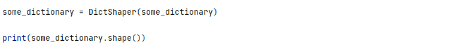
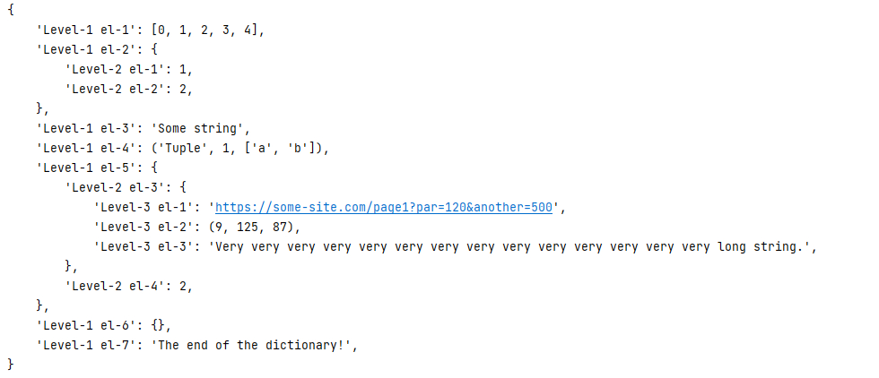
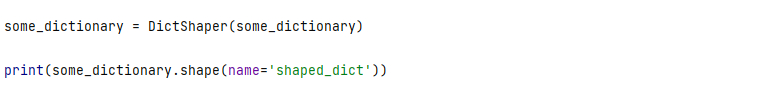
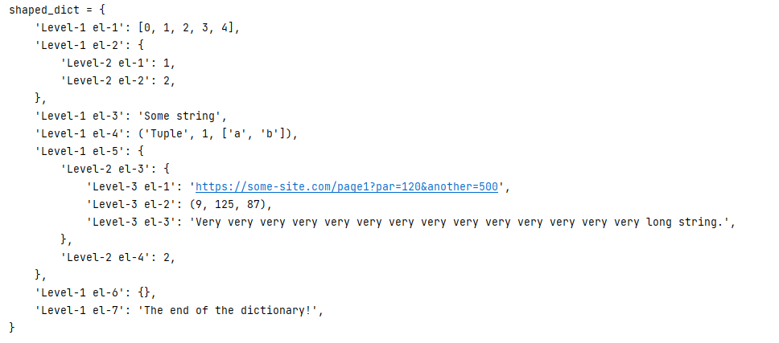
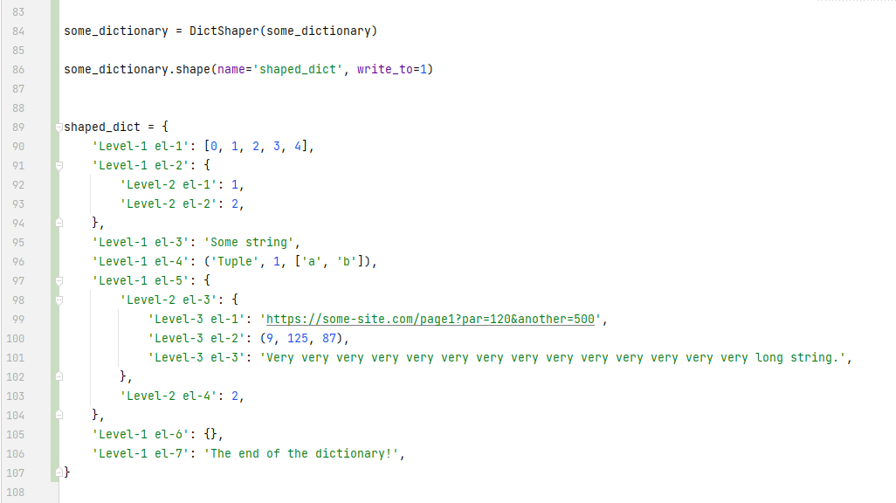

# DictShaper

> The module for convenient viewing of dictionary 
> with the all necessary indents.

This module extends the standard `dict` class, so you can
use all its properties and methods. Over all of this `DictShaper`
adds the new method `shape()`. You can also give a name for your
dictionary by the `name=` param.

> *your_dictionary.shape(___name='any_name'___)*

You can also add a path to a file for writing the dictionary there,
using the `write_to=` param. It will be writing in a convenient view,
like in an example below.

> *your_dictionary.shape(name='any_name', ___write_to='any_path'___)*

If you set as a value `1` or `True` in `write_to=` param then the
dictionary will be writing to the end of a current file.

### EXAMPLE

We will work with the dictionary below called **'some dictionary'**.

`some_dictionary = {'Level-1 el-1': [0, 1, 2, 3, 4], 'Level-1 el-2': {'Level-2 el-1': 1, 'Level-2 el-2': 2}, 'Level-1 el-3': 'Some string', 'Level-1 el-4': ('Tuple', 1, ['a', 'b']), 'Level-1 el-5': {'Level-2 el-3': {'Level-3 el-1': 'https://some-site.com/page1?par=120&another=500', 'Level-3 el-2': (9, 125, 87), 'Level-3 el-3': 'Very very very very very very very very very very very very very very long string.'}, 'Level-2 el-4': 2}, 'Level-1 el-6': {}, 'Level-1 el-7': 'The end of the dictionary!'}
`

> ### For output to console without a name
> 
> 
> 

> ### For output to console with a name
> 
> 
> 

> ### For write to a file with a name
> 
> 